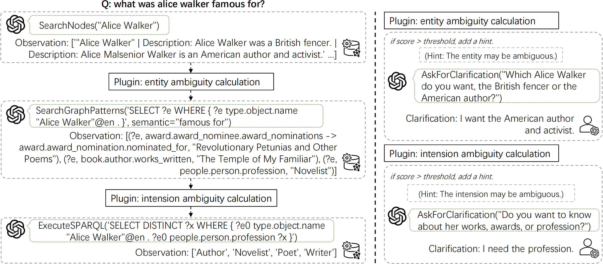

# CLEAR-KGQA


This repository contains the official code for IJCNN 2025 paper "CLEAR-KGQA: Clarification-Enhanced Ambiguity Resolution for Knowledge Graph Question Answering"

<div align="center">

[](TBC)
[](https://arxiv.org/abs/2504.09665)

</div>

This figure illustrates the overall process.

<div align="center">
  
</div>

## DB and Tool Setup

Please follow the instructions in [Interactive-KBQA](https://github.com/JimXiongGM/Interactive-KBQA) to setup the DB and tool.

You need to extract the data: `tar -xzf dataset_processed-v2.0.tar.gz`. 
Additionally, be sure to set your OpenAI API key in the environment variable `OPENAI_API_KEY`.


## Start PPL Service

A GPU with 24GB of VRAM is required to start the PPL service.

```bash
# start server
CUDA_VISIBLE_DEVICES=0 python api/llm_ppl_sever.py --model meta-llama/Meta-Llama-3.1-8B-Instruct --port 26000

# Configure DEFAULT_PPL_SERVER in `common/constant.py`. This is a test command.
python api/llm_ppl_client.py --sentence "The quick brown fox jumps over the lazy dog."
```

## Run

You can directly use GPT-4o, or use the fine-tuned model (also follow the instructions in Interactive-KBQA) as the actor.

Run the following commands to get the experimental results.

```bash
export model_name="gpt-4o-2024-08-06"
# e.g. export model_name=output-dialog/webqsp+cwq/Meta-Llama-3.1-8B-Instruct-epoch10

# -------------------------- WebQSP -------------------------- #
# use plugin
python run_interactive.py --dataset webqsp --model_name $model_name

# generate clear question (based on plugin result)
python run_gen_clearq.py --pattern "save/v1/webqsp/$model_name/*-dummy_user.json"

# use clear_q (no plugin, no AskForClarification, the same with Interactive-KBQA)
python run_interactive.py --dataset webqsp --model_name $model_name --plugin False --use_clear_q True

# -------------------------- CWQ -------------------------- #
# use plugin
python run_interactive.py --dataset cwq --model_name $model_name --plugin True

# generate clear question (based on plugin result)
python run_gen_clearq.py --pattern "save/v1/cwq/$model_name/*-dummy_user.json"

# use clear_q (no plugin, no AskForClarification, the same with Interactive-KBQA)
python run_interactive.py --dataset cwq --model_name $model_name --plugin False --use_clear_q True 
```

We also upload the experimental results, use `tar xzf save-clear-kgqa-v1.0.tar.gz` to extract the files.

The clear question is in the `clear_q` field of `save/v1/[webqsp|cwq]/gpt-4o-2024-08-06/*-dummy_user.json` files. Only items with ambiguity have values in this field.


## Evaluation

The path of the prediction files follows a specific pattern, for example:
```
save/v1/cwq/gpt-4o-2024-08-06/*.json
```

```bash
python evaluation/eval_all.py --path save/v1/webqsp/gpt-4o-2024-08-06
python evaluation/eval_all.py --path save/v1/cwq/gpt-4o-2024-08-06
```

## Citation

TBC
